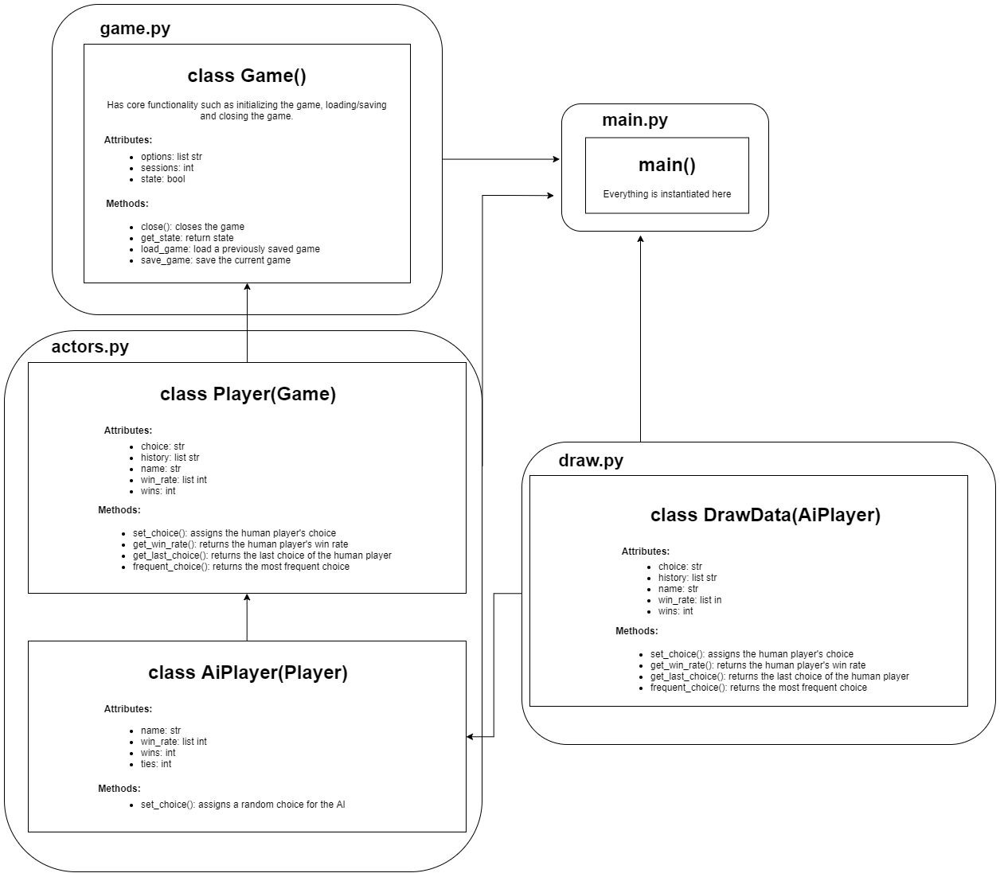

# Rock Paper Scissors
AI plays RPS based on a mix of the frequency and patterns of the moves played by the human player.

Written with Python for the Carleton AI Society Fall 2019 group project which can be found here: https://github.com/carletonai

  

